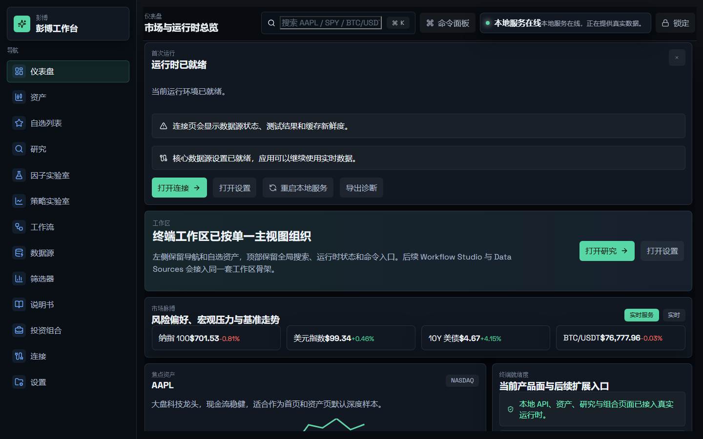
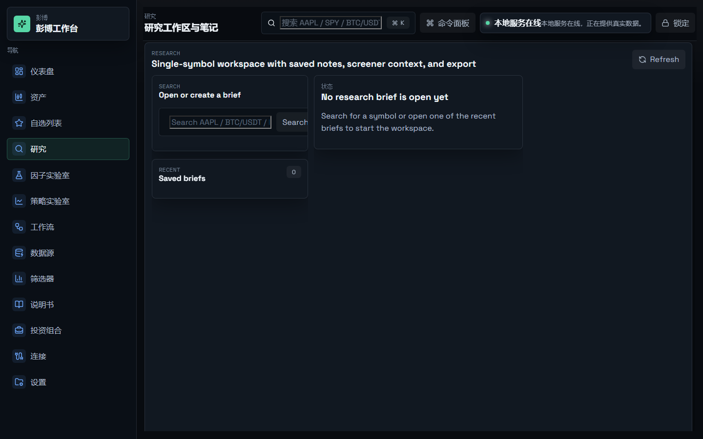
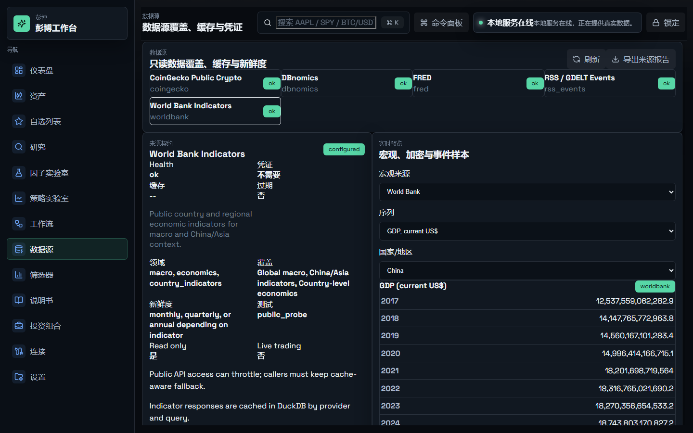
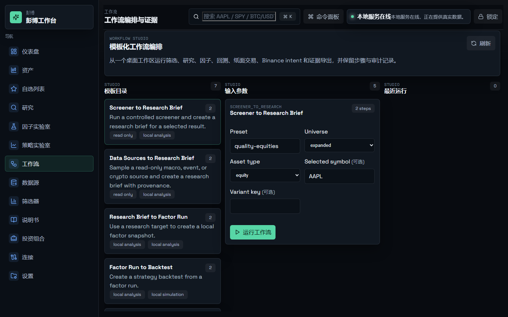
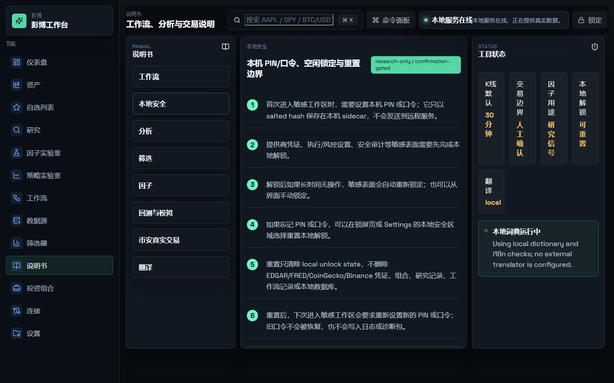

# Pengbo Workbench

Pengbo Workbench is a local-first desktop financial terminal built with Tauri, React, FastAPI, SQLite, and DuckDB. It combines research, screening, portfolio analysis, factor exploration, strategy simulation, workflow automation, and read-only data-source inspection in one packaged desktop shell.

The current product is designed for local desktop use. It is not a hosted web service, and the local FastAPI sidecar is expected to bind to `127.0.0.1`.

## Product Direction

Pengbo Workbench is intended to become a local-first, privacy-first, auditable personal financial research workspace. The near-term goal is not to copy the full breadth of Bloomberg or institutional terminals. The product should first make one complete research loop reliable: choose an asset or theme, inspect data status, review evidence, form a research brief, connect that brief to portfolio or strategy context, and export a report with provenance and risk boundaries.

The first target users are independent investors, small research or portfolio teams, quant learners, and Chinese/English desktop users who want a practical local tool rather than a hosted SaaS account.

## Current Roadmap

The active roadmap is tracked in [IMPLEMENTATION_TASKS.md](IMPLEMENTATION_TASKS.md). The current security-accountability sequence is complete:

1. `T53 - Local Unlock PIN And Idle Lock` is implemented and package-smoke validated.
2. `T54 - Account-Scoped Provider Credential Model` is implemented and package-smoke validated.
3. `T55 - Future Public Auth And Session Layer` is implemented as a local-only session, permission, and audit boundary.
4. `T56 - Public Exposure Gateway And Sidecar Hardening` is implemented as a local-only gateway boundary with loopback bind enforcement, unsafe-origin rejection, method handling, rate-limit hooks, and redacted gateway audit evidence.

These tasks were intentionally prioritized before broader public, account, remote, team, AI, or China-market connector work. The next roadmap lane begins at `T57 - License And Open Source Boundary`, followed by open-source readiness, CI, releases, demo mode, contributor readiness, research-flow polish, data governance, local AI assistance, China-market connectors, and security packaged signoff.

`T58 - Version Governance Cleanup`, `T59 - GitHub Actions CI Baseline`, `T60 - Demo Mode And No-Key Startup`, `T61 - First Release Packaging`, `T62 - README Product Proof Upgrade`, `T63 - Contributor Entry Kit`, `T64 - Research Flow Definition`, `T65 - Asset Page Research Entry Polish`, `T66 - Data Status Strip Everywhere`, `T67 - Research Brief Quality Upgrade`, `T68 - Report Export Evidence Pack`, `T69 - Command Center V1`, `T69# Temp - Packaged Desktop Video Walkthrough`, `T70 - First-Run Product Onboarding`, `T71 - Provider Capability Matrix`, `T72 - Provider Credential State Model`, `T73 - Provider Freshness And Cache Policy`, `T74 - Data Quality Status Contract`, `T75 - Provenance UI And Export Sync`, `T76 - Existing Provider Audit`, `T77 - Data Sources Packaged Signoff V2`, and `T78 - Local LLM Runtime Probe` are implemented. The first GitHub Release is available at [v0.1.0](https://github.com/LaurenceFang/pengbo-workbench/releases/tag/v0.1.0). The next product-trust task is `T79 - AI Permission Boundary`.

For the product-team assessment behind this direction, see [docs/product-team-assessment-2026-05-17.md](docs/product-team-assessment-2026-05-17.md).

For the primary research journey that guides the next polish tasks, see
[docs/research-flow-definition.md](docs/research-flow-definition.md).

## Product Proof

Pengbo is already a usable local desktop research workspace, not just a backend demo. A no-key reviewer can launch the app, inspect seeded market context, review data-source provenance, run template-driven workflow setup, and read the local safety manual without provider credentials.



The core loop is designed around evidence and boundaries:

- Start from the dashboard and choose an asset, data source, screener, or workflow.
- Use the first-run checklist to understand demo mode, provider setup, local unlock, privacy boundaries, and live-execution gates before exploring sensitive areas.
- Use Command Center to search a symbol, open or create its Research brief, refresh providers, export local reports, inspect audit context, and run no-secret readiness checks from one compact surface.
- Use Research to create a durable local brief with notes, analysis modules, source context, structured data-quality status, and export handoffs.
- Use Data Sources to inspect packaged catalog coverage, read-only provider contracts, cache state, TTL, refresh behavior, offline fallback, provenance, freshness, data quality, and credential requirements.
- Use Workflow Studio to run bounded templates that connect screeners, data sources, research, factors, backtests, paper trading, Binance intents, and reports.
- Use Manual and Settings to understand local unlock, reset behavior, data boundaries, and live-trading confirmation rules.

| Research workspace | Data-source provenance |
| --- | --- |
|  |  |

| Workflow Studio | Local security manual |
| --- | --- |
|  |  |

These screenshots were regenerated from a temporary no-secret local runtime for documentation. They are safe source assets; generated smoke logs, local databases, Stronghold vaults, packaged binaries, installers, and machine-local diagnostics remain ignored.

## Versioning

The current pre-release baseline is `0.1.0`. Version metadata is kept aligned across `package.json`, `package-lock.json`, `src-tauri/tauri.conf.json`, `src-tauri/Cargo.toml`, and `backend/app/version.py`.

Use `npm run check:version` before release or CI work to confirm the source, desktop package, and sidecar version story remains consistent. See [CHANGELOG.md](CHANGELOG.md) for the public-facing change history.

## License And Public Boundary

Pengbo Workbench source and documentation are licensed under the [Apache License 2.0](LICENSE).

The public repository boundary is intentionally source-first. It includes application source, tests, rebuildable configuration, and curated documentation. It does not include local runtime databases, Stronghold vaults, provider credentials, `.env*` files, diagnostics, generated smoke logs, packaged desktop bundles, generated sidecar payloads, installers, or machine-local automation state.

The license does not change the product safety boundary: Pengbo is currently a local desktop research terminal. It is not a hosted service, not a public API, not a multi-user account system, and not a remote trading service.

## Workspaces

- Dashboard: runtime readiness, market pulse, watchlist, and handoffs into the main workflows.
- Asset: quote/history views, provider capability state, filings/fundamentals context, and multi-period charts.
- Research: durable local briefs, structured analysis modules, notes, exports, and handoffs from screeners and data sources.
- Screeners: preset-driven and variant-tuned screening with bounded user controls.
- Portfolio: offline-first holdings, transactions, valuation states, analytics, allocation views, and data-quality limitations.
- Factor Lab: research-only factor runs across equities, ETFs/index proxies, indexes, and crypto.
- Strategy Lab: local backtests, paper trading ledgers, Binance execution intents, risk evidence, and audit context.
- Workflow Studio: template-driven local workflows with explicit manual boundaries.
- Data Sources: read-only source catalog, provenance, credential status, freshness TTL/cache policy, data-quality status, offline fallback, and report export.
- Manual: product guidance, safety boundaries, workflow explanations, and translation status.

## Safety Boundaries

- Non-Binance providers are read-only and must not create live trading paths.
- Binance live execution remains default-off, risk-gated, kill-switch gated, and user-confirmed.
- Workflow Studio may create a Binance intent artifact, but submit requires an explicit user-owned confirmation step.
- Sensitive local sidecar routes now use a desktop auth session header and route-level permission checks; this is not OAuth, hosted identity, remote sync, or a public login system.
- Provider secrets, Stronghold data, local databases, smoke artifacts, and generated binaries should not be committed to a public repository.
- API source code can be committed; API keys, tokens, secrets, local identities, and provider credentials must not be committed.
- Current sensitive values include EDGAR identity, Binance API key/secret, FRED key, CoinGecko key, and `PENGBO_TRANSLATION_API_KEY`.
- Stronghold is a local single-user desktop secret store. It is not a multi-user permission system and does not protect against higher-privilege processes on the same machine.
- Public network exposure, multi-user accounts, sessions, and hosted operation are deferred until the relevant security tasks are explicitly selected and implemented.

See [docs/SECURITY_ARCHITECTURE.md](docs/SECURITY_ARCHITECTURE.md) and [docs/REPOSITORY_UPLOAD_READINESS.md](docs/REPOSITORY_UPLOAD_READINESS.md) for the current local-first boundary.

## No-Key Demo Evaluation

A fresh checkout can be evaluated without EDGAR, FRED, CoinGecko, Binance, or translation credentials. The app exposes a no-key demo readiness state through `/api/v1/settings/demo-mode`, shows seeded/sample context on the dashboard, portfolio, data-source, screener, research, and workflow surfaces, and keeps credential-gated capabilities visibly marked as `credential_required` or `missing_credentials`.

Demo mode is not a live-trading shortcut. It cannot read private Binance account state, submit live orders, store provider secrets, or bypass local unlock, session, and gateway checks. Use `npm run smoke:demo-no-key` to validate the source-level no-key startup path.

## Local Development

Install JavaScript dependencies:

```powershell
npm install
```

Install Python dependencies in your preferred virtual environment:

```powershell
py -m pip install -r backend/requirements.txt
```

Run the web shell and local sidecar in separate terminals:

```powershell
npm run dev
npm run backend:dev
```

Build the web shell:

```powershell
npm run typecheck
npm run check:version
npm run build
```

Build the Python sidecar payload used by the Tauri bundle:

```powershell
npm run sidecar:build
```

Build the packaged desktop app:

```powershell
npm run tauri:build
```

For the local unsigned release-artifact checklist, see [docs/RELEASE_CHECKLIST.md](docs/RELEASE_CHECKLIST.md).

## Validation

Common validation commands:

```powershell
py -m unittest discover -s backend/tests -p "test_*.py"
npm run check:version
npm run check:public-boundary
npm audit --audit-level=moderate
npm run typecheck
npm run build
npm run smoke:demo-no-key
npm run smoke:packaged-startup
npm run smoke:installed-startup
npm run smoke:installed-startup:nsis
```

## Continuous Integration

GitHub Actions runs a no-secret source baseline on pushes to `main`, pull requests, and manual dispatches. The CI workflow installs dependencies, checks version consistency, scans the public repository boundary, runs `npm audit --audit-level=moderate`, typechecks, builds the frontend, and runs backend unit tests. Backend CI dependencies come from `backend/requirements.txt`.

CI does not use provider credentials, GitHub secrets, live trading permissions, packaged desktop smoke tests, Tauri release builds, installer validation, signing, or hosted update checks. Packaged EXE smoke evidence remains a local Windows release-readiness step until a dedicated release workflow is selected.

Packaged smoke checks should be run serially because they start and stop the same release executable and may backup/restore the same AppData-backed runtime directory:

```powershell
npm run smoke:packaged-startup
npm run smoke:data-sources:packaged
npm run smoke:workflow-studio:packaged
```

Run only the smoke checks relevant to the files changed in a given task. Documentation-only and ignore-only changes normally do not require packaged smoke validation.

## Contributing

Start with [CONTRIBUTING.md](CONTRIBUTING.md) for local setup, source-level
validation, safe first-issue areas, and the current credential, execution,
gateway, and release-sensitive contribution boundaries.

## Repository Upload Notes

This repository should be uploaded as source plus documentation, not as a packaged release directory. Generated outputs such as `dist/`, `src-tauri/target/`, `src-tauri/binaries/`, local runtime data, logs, diagnostics, secrets, and Stronghold stores are intentionally ignored for public upload.

The repository is licensed under Apache-2.0. Third-party dependencies keep their own licenses; verify dependency redistribution obligations before publishing packaged binaries or app-store style releases.

`src-tauri/tauri.conf.json` references `../logs/sidecar-build-latest.json` as a local package resource. That file is produced by `npm run sidecar:build`, may contain machine-local build paths, and should be regenerated locally rather than committed as source.

If a fresh checkout needs packaged desktop artifacts, rebuild them locally with `npm run sidecar:build` and `npm run tauri:build`.
